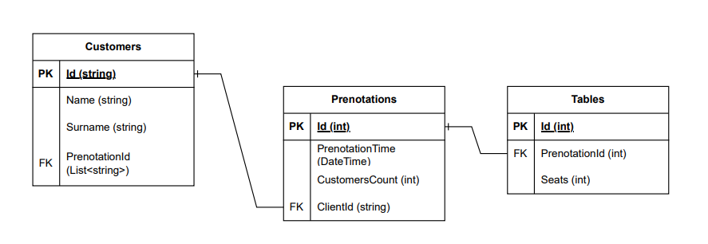

# Lume-Server User Guide

Lume-Server is a RESTful API developed as part of a school project to manage restaurant data. This guide helps users understand how to set up and interact with the API.
<div align="center">
   
⛩️ [**Features**](#-features) **|** 🚩[**Updates**](#-updates) **|** ⚡[**Usage**](#-quick-inference) **|** 🔧[Install](#-dependencies-and-installation)  **|** ❓[FAQ](docs/FAQ.md) **|** 🎨[Contribution](docs/CONTRIBUTING.md)

</div>

## ⛩️ Features

- **CRUD Operations**: Manage restaurant data, menus, orders, and reservations with the standard Create, Read, Update and Delete.
- **Secure Authentication**: Endpoints secured using JWT-based authentication.
- **Scalable & Modular**: Provides a scalable server that can be deployed both in verical and orizzontal scalability, all of this could be achived by having a both powerful and efficent backend:
     •[PostgreSQL](https://www.postgresql.org/)
     •[.NET 9.0 SDK](https://dotnet.microsoft.com/en-us/download)
     •[BLAKE3 implementation](https://github.com/BLAKE3-team/BLAKE3)

- **Extensible**: Supports additional features like user management and order processing.
- **Develoling-ready**: Proper implementation of [Swagger](https://swagger.io/) and [Serilog](https://serilog.net)
## Technologies Used

- **Backend**: C# with ASP.NET Core 9.0 SDK
- **Database**: PostgreSQL
- **Authentication**: JSON Web Tokens (JWT)
- **Development Tools**: Visual Studio, JetBrains Rider, Zeditor

## 🚩 Updates

- ✅ Added integration with serilog
- ✅ Updated API endpoint with staff
- ✅ Implented the JWT token
- ✅ Added working swagger ui
- ✅ The database connection now works ✨
---

## 🔧 Dependencies and Installation

- [PostgreSQL](https://www.postgresql.org/download/)
- [.NET SDK = 9.0](https://dotnet.microsoft.com/en-us/download/dotnet/9.0)
### Installation

1. Clone repo

    ```bash
    git clone https://github.com/school-project-restaurant/Lume-Server.git
   cd Lume-Server
    ```

2. Install dependent packages

    ```bash
    # Install postgresSQL (only if you run rhe database on your local machine) and .NET 9.0 SDK
    # On debian based OS
    apt install postgresql
    apt install dotnet-sdk-9.0
    apt install aspnetcore-runtime-9.0

    # On RHEL
    dnf install postgresql-server
    dnf install dotnet-sdk-9.0
    dnf install aspnetcore-runtime-9.0
    ```

3. **Configure the database:**
   - Update the `SECRETS.env` file with your database connection details.
4. **Build and run the project:**
   ```bash
   dotnet build
   dotnet run
   ```
   The API should now be accessible at [http://localhost:5155](http://localhost:5155).

## ⚡ Quick Inference

There are usually two ways to interface with Lume-API
1. [Direct request to the endpoint](endpoint-request)
2. [Using Swagger](#Swagger)

### Endpoint request
1. Can be done with [Curl](https://curl.se)
```bash
curl -X POST your.domain.name/api ...
curl -X GET your.domain.name/api
curl -X DELETE your.domain.name/api
curl -X UPDATE your.domain.name/api
```
with [Postman](https://www.postman.com)
or any other software you like

## API Usage

### Available Endpoints

Below is a summary of the core endpoints.

#### Clients
- **GET /clients** – Fetch all clients.
- **GET /clients/{id}** – Retrieve details of a specific client.
- **POST /clients** – Add a new client.
- **PATCH /clients/{id}** – Update an existing client.
- **DELETE /clients/{id}** – Remove a client.
- **GET /clients/{id}/reservations** - Get customer reservations.
- **POST /clients/{id}/reservations** - Add a new reservations for a customer.

## Database Schema

The database structure is outlined in the diagram below:

<p>
   
</p>

## License

This project is licensed under the GNU3 License. See the [LICENSE](LICENSE) file for details.

